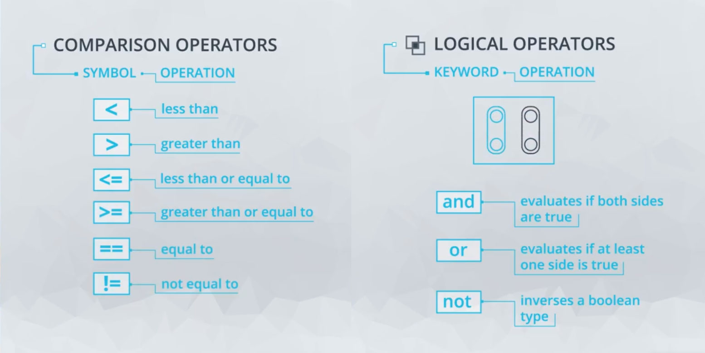

# Lesson Summary

here's a recap of the data types and operators we covered.

## Data Types

| Data Type | Constructor |      Example       |
| :-------: | :---------: | :----------------: |
|    int    |    int()    |         5          |
|   float   |   float()   |        6.5         |
|  string   | '',"",str() | "this is a string" |
|   bool    |   bool()    |   true or false    |

## Operators

## Additional Practice Resources 

[Hacker Rank](https://www.hackerrank.com/domains/python)

[Code Wars](https://www.codewars.com/dashboard)